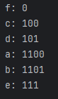
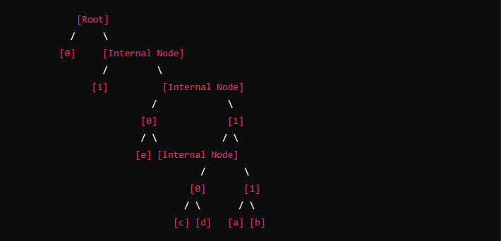

# 📜 Entendendo o Algoritmo de Huffman

## 🔍 Como Funciona o Algoritmo de Huffman

1. **🌳 Construção da Árvore de Huffman:**
    - O algoritmo constrói uma árvore binária onde cada folha representa um símbolo dos dados originais e suas frequências.
    - Os símbolos com menor frequência são mais profundos na árvore e recebem códigos mais longos.
    - Os símbolos com maior frequência são mais próximos da raiz e recebem códigos mais curtos.

2. **🛠️ Criação do Código:**
    - Cada caminho da raiz até uma folha da árvore gera um código binário.
    - O caminho para a esquerda adiciona um `0` ao código, e o caminho para a direita adiciona um `1`.

## 📊 Resultado do Código

O resultado gerado foi:




Vamos analisar como esse código é gerado:

1. **🌱 Construção da Árvore:**
   - Começamos com folhas representando cada símbolo com suas frequências:
     ```
     a: 5
     b: 9
     c: 12
     d: 13
     e: 16
     f: 45
     ```

   - Os dois nós com menor frequência são combinados:
      - `a` e `b` com frequência 5 e 9 → cria um novo nó com frequência 14.
      - O novo nó se torna um dos filhos da árvore.

   - A árvore continua a combinar os nós restantes:
      - O próximo nó com menor frequência é combinado com o nó recém-criado (frequência 14).

   - Esse processo continua até que todos os nós estejam combinados em uma única árvore.

2. **📝 Atribuição dos Códigos:**
   - O caminho da raiz até cada folha determina o código binário:
      - `f` é a folha mais próxima da raiz, então seu código é `0`.
      - `c`, `d`, `a`, `b`, e `e` são mais profundos na árvore e têm códigos mais longos.

## 🧩 Explicação do Código

Vamos decodificar o código binário obtido:

1. **`f: 0`**
   - `f` tem a frequência mais alta e está mais próximo da raiz, recebendo o código mais curto.

2. **`c: 100`**
   - `c` é mais profundo na árvore, recebendo um código mais longo.

3. **`d: 101`**
   - Similar a `c`, mas com uma pequena diferença no caminho.

4. **`a: 1100`**
   - `a` está mais longe da raiz e, portanto, recebe um código ainda mais longo.

5. **`b: 1101`**
   - `b` é um pouco mais profundo na árvore em comparação com `a`, resultando em um código binário semelhante, mas com uma diferença na sequência.

6. **`e: 111`**
   - `e` está mais distante da raiz do que `c` e `d`, mas mais próximo do que `a` e `b`.

## 🌲 Visualização da Árvore

Aqui está uma representação visual simplificada da árvore de Huffman com base no resultado:




Neste exemplo, a árvore pode ser diferente dependendo da ordem das combinações e das frequências dos símbolos.

## 📌 Conclusão

O algoritmo de Huffman gera códigos binários baseados na frequência dos símbolos. Os símbolos mais frequentes são representados por códigos mais curtos, e os menos frequentes têm códigos mais longos. Isso resulta em uma codificação eficiente, reduzindo o tamanho total dos dados codificados.
