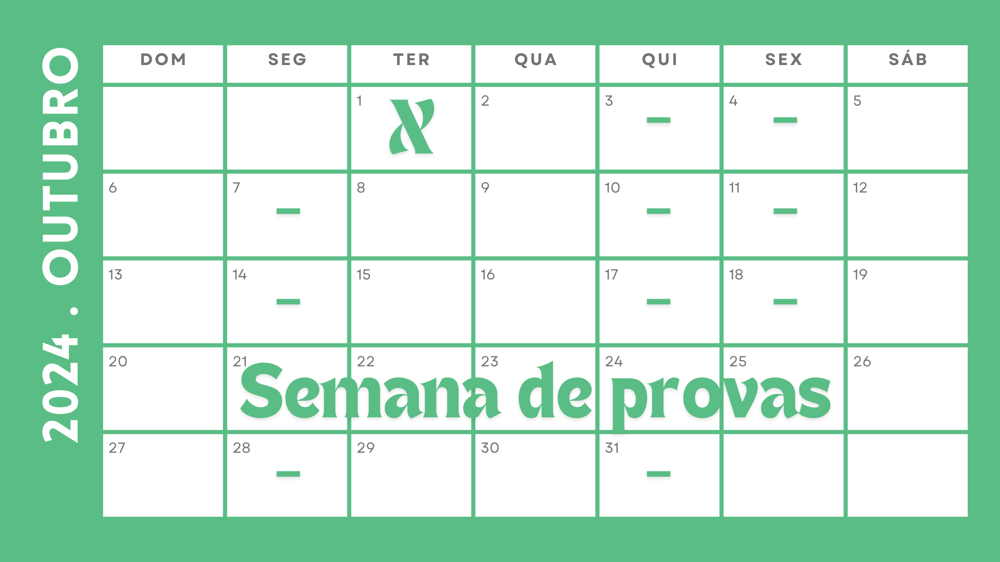

<h2 align="center">

  

# Repositório para Monitoria de Estrutura de Dados 

 
 

# :mag: Programa Ampliar Tecnologias

Olá, este repositório é exclusivo para uso durante o módulo 53/2024 do Programa Ampliar Tecnologias 
Monitoria de Estrutura de Dados

## :innocent: Sobre mim

Olá, sou Mauricio De Oliveira, um estudante do curso de Engenharia de Software na Unicesumar, atualmente na 15ª série.

Além de me dedicar aos estudos, tenho o privilégio de atuar como monitor na disciplina de Estrutura de Dados, por meio do programa Ampliar Tecnologias da Unicesumar. Essa oportunidade não apenas reforça meu entendimento dos conceitos fundamentais, mas também me permite compartilhar meu entusiasmo pela tecnologia com meus colegas.

Atualmente, estou empregado como técnico de automação na indústria, onde trabalho diretamente na manutenção de células robóticas. Este papel desafiador me proporciona uma visão prática e valiosa sobre as aplicações da tecnologia no mundo real, consolidando ainda mais minha paixão por inovação e progresso.

Nasci, cresci e construí minha família em Ponta Grossa, Paraná, uma cidade que me ensinou o valor da comunidade e da determinação.

Minha verdadeira paixão reside na exploração e experimentação com tecnologias emergentes. Um dos meus hobbies favoritos é trabalhar com Raspberry Pi, onde posso aplicar minha criatividade e habilidades técnicas para criar projetos fascinantes.

Estou em um momento de transição de carreira, ansioso para explorar novas oportunidades que me permitam mergulhar ainda mais no universo da tecnologia e inovação.

Estou ansioso para conectar com colegas e profissionais que compartilham minha paixão e visão para o futuro impulsionado pela tecnologia.

## :computer: Sobre a monitoria

• Construir raciocínio lógico para interpretação de problemas reais. 
• Desenvolver algoritmos a partir das estruturas lógicas de representação básicas de dados para sistemas computacionais. 
• Aprender a cruzar dados por meio de tabelas com intuito de trabalhar com a mineração dos mesmos. 
• Aplicar técnicas de ordenação e consulta de dados para otimizar a busca de valores dentro de um determinado programa. 
• Sistematizar técnicas de representação computacional por meio de grafos de forma a melhorar a busca em programas. 

## :globe_with_meridians: Encontros presenciais ao vivo

:calendar: Terças e Quartas-feiras   :alarm_clock: Das 20h às 22h. 

Via Teams acessando este [link](https://www.google.com/url?q=https%3A%2F%2Fteams.microsoft.com%2Fl%2Fmeetup-join%2F19%253ameeting_NGFjMTdkYmItNDRmMC00MThiLTljZmEtYjNmZTZlYmNlMDhm%2540thread.v2%2F0%3Fcontext%3D%257b%2522Tid%2522%253a%2522311bf579-63f2-426a-80aa-d3a26f1c0ad1%2522%252c%2522Oid%2522%253a%2522d9d9f61f-3b69-4da3-bd9b-e8237deec503%2522%257d&sa=D&sntz=1&usg=AOvVaw3WEXDDJ5X9Vh2UpvqKufIL)

===========================================================================

|  |  |  | 
| :---: | :---: | :---: 

===========================================================================

## :bookmark_tabs: Estrutura de Dados I
### :books: Conteúdo programático
#### :memo: UNIDADE I: PONTEIROS
✅ [Estruturas Homogêneas e Heterogêneas](./C_Codes/Revisão%20estruturas/revisaoEstruturas.c) 
✅ [Vetores e Matrizes](./C_Codes/Revisão%20estruturas/revisaoEstruturas.c) 
✅ [Structs](./C_Codes/Revisão%20estruturas/revisaoEstruturas.c) 
⬛ [Ponteiros](./C_Codes/Ponteiros/) 
⬛ [Propriedades de Ponteiros](./C_Codes/Ponteiros/pointer.c) 
⬛ [Alocação Dinâmica na Memória](./C_Codes/Ponteiros/pointerMalloc.c) 
⬛ [Criando Vetores Dinâmicos](./C_Codes/Ponteiros/dynamicArray.c) 
⬛ Considerações Finais  

#### :memo: UNIDADE II: PILHAS E FILAS
⬛ Pilhas 
⬛ Filas 

#### :memo: UNIDADE III: LISTAS DINÂMICAS
⬛ Fundamentos de Listas Dinâmicas 
⬛ Implementando uma Lista Dinâmica 
⬛ Lista Dinâmica com Forma de Pilha 
⬛ Lista Dinâmica com Forma de Fila  

#### :memo: UNIDADE IV: GRAFOS
⬛ Sete Pontes de Königsberg 
⬛ Teoria dos Grafos 
⬛ Grafos Como Representação de Problemas 
⬛ Representação Computacional de Grafos 
⬛ Implementando Grafos em C  

#### :memo: UNIDADE V: BUSCA EM GRAFOS
⬛ Busca em Grafos 
⬛ Busca em Profundidade 
⬛ Busca em Largura 
⬛ Algoritmo de Dijkstra 

## :bookmark_tabs: Estrutura de Dados II
### :books: Conteúdo programático

#### :memo: UNIDADE I: ÁRVORES BINÁRIAS
⬛ Árvore Binária 
⬛ Árvore Estritamente Binária 
⬛ Árvore Binária Completa 
⬛ Implementando Árvore Binária em C 

#### :memo: UNIDADE II: OPERAÇÕES SOBRE ÁRVORES BINÁRIAS
⬛ Caminhamento em Árvores Binárias 
⬛ Percurso Pré-Ordem 
⬛ Percurso Em-Ordem 
⬛ Percurso Pós-Ordem 
⬛ Busca em Árvores Binárias 
⬛ Árvores AVL 

#### :memo: UNIDADE III: TÉCNICAS DE ORDENAÇÃO
⬛ Ordenação por Bubblesort (Método da Bolha) 
⬛ Ordenação por Selectionsort 
⬛ Ordenação por Insertionsort 
⬛ Ordenação por Shellsort 

#### :memo: UNIDADE IV: ALGORITMOS DE ORDENAÇÃO AVANÇADOS
⬛ Ordenação por Mergesort 
⬛ Ordenação por Quicksort 
⬛ Ordenação por Heapsort 

#### :memo: UNIDADE V: OPERAÇÕES DE BUSCA
⬛ Operação de Busca Sequencial 
⬛ Busca Sequencial Indexada 
⬛ A Busca Binária 
⬛ Busca por Interpolação 
⬛ Tabela de Dispersão 

   

Programa Ampliar Tecnologias - Estrutura de Dados

Copyright :copyright: 2024

